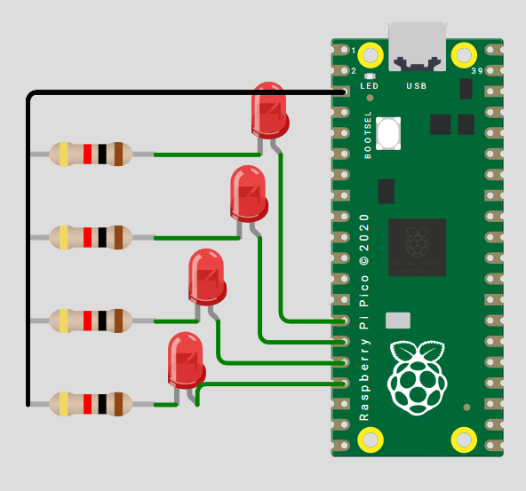

# Practica 1: Outputs Basicos
---
## 1) Resumen

Nombre del proyecto: Prácticas de LEDs con Raspberry Pi Pico 2

Equipo / Autor(es): Rodrigo Zarate Fernandez

Curso / Asignatura: Sistemas Embebidos / Microcontroladores

Fecha: 27/08/2025

Descripción breve:
Conjunto de programas que utilizan la Raspberry Pi Pico 2 para controlar LEDs mediante lógica binaria y máscaras:

Contador binario de 4 bits.

Barrido de LEDs.

Secuencia en código Gray.

## 2) Objetivos

### General:
Aprender el manejo de GPIOs en Raspberry Pi Pico 2 y aplicar operaciones de máscaras lógicas para controlar múltiples LEDs.

### Específicos:

Implementar un contador binario en LEDs.

Realizar un barrido de un LED encendido en secuencia.

Programar la secuencia de código Gray en 4 bits.

## 3) Alcance y Exclusiones

### Incluye:

    * Código en MicroPython para los tres ejercicios.

    * Esquemático básico de conexiones.

    * Documentación en Markdown para integrar en página o repositorio.

### No incluye:

    * Variantes en otros lenguajes (C, C++).

    * Diseño de PCB.

    * Ejecución en simuladores (solo hardware real).

## 4) Requisitos

### Software:

    * Thonny IDE o uPyCraft.

    * Firmware MicroPython en Raspberry Pi Pico 2.

### Hardware

Componente	| Cant.	| Nota
Raspberry Pi Pico 2	| 1	|MCU principal
LED rojo | 	5   |Para los ejercicios
Resistencias 1 kΩ|	5|	Limitadoras de corriente
Protoboard	|1|	Conexión rápida
Cables Dupont	|Varios	|Macho–macho

Conocimientos previos

Operaciones bit a bit (&, |, <<, >>).

Uso de máscaras binarias.

Programación básica en MicroPython.
## 5) Desarrollo

### 5.1  Contador binario de 4 bits
#### Esquematico

``` codigo
#include <stdio.h>
#include "pico/stdlib.h"
#define A 12
#define B 13    
#define C 14
#define D 15

const uint32_t LED_MASK = (1u << A) | (1u << B) | (1u << C) | (1u << D) ;


int main() {
    stdio_init_all();
    gpio_init_mask(LED_MASK);
    gpio_set_dir_out_masked(LED_MASK);
    gpio_put_masked(LED_MASK, 0);

    while (true) {

        for (uint32_t n = 0; n < 16; n++) {
            gpio_put_masked(LED_MASK, n<<12);
            sleep_ms(1000);
        } 
       /* gpio_put_masked(LED_MASK, LED_MASK);*/
    }
    return 0;
}
```
#### Video
[Video Selector Ciclico](https://youtube.com/shorts/twmNGeeP-nU?si=mZBkW5TyqbBxRJ5B)
---
### 5.2 Barrido leds
#### Esquematico

``` codigo
#include <stdio.h>
#include <stdint.h>
#include "pico/stdlib.h"

#define LED0 0
#define LED1 1
#define LED2 2
#define LED3 3
#define LED4 4

#define LED_MASK ((1u << LED0) | (1u << LED1) | (1u << LED2) | (1u << LED3) | (1u << LED4))

int main() {
    stdio_init_all();
    gpio_init_mask(LED_MASK);
    gpio_set_dir_out_masked(LED_MASK);

    int pos = 0;
    int dir = 1; // 1 = derecha, -1 = izquierda

    while (true) {
        uint32_t value = (1u << pos);
        gpio_put_masked(LED_MASK, value);
        sleep_ms(200);

        pos += dir;

        if (pos == 4) dir = -1; // extremo derecho
        if (pos == 0) dir = 1;  // extremo izquierdo
    }
    return 0;
}
```
#### Video
[Video Selector Ciclico](https://youtube.com/shorts/twmNGeeP-nU?si=mZBkW5TyqbBxRJ5B)
---
### 5.3 Secuencia en codigo Gray
#### Esquematico

``` codigo

```
#### Video
[Video Selector Ciclico](https://youtube.com/shorts/twmNGeeP-nU?si=mZBkW5TyqbBxRJ5B)